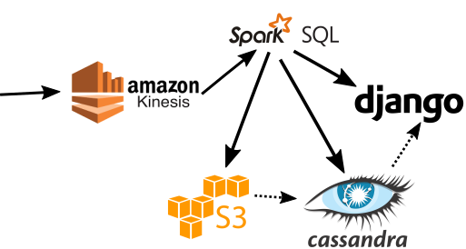

# Higher Order Functions in SparkSQL

## One sentence description
Implement higher order functions in SparkSQL; this is particularly useful to query nested JSON files.

## Details and use-case

It is a [feature request](https://issues.apache.org/jira/browse/SPARK-19480) in the SparkSQL project.

Demonstrate these higher order functions with an app that processes images by

- live streaming results about aggregated counts of images per location
- store the images by location in S3 while storing links to the images and their metadata in Cassandra sorted by location for further querying
- this setup allows efficient querying of images if we expect most queries to containg a location restriction (maybe users only want to see results in their location)

This will allow other apps to query the image database efficiently by location.
If time permits, offer users to query the image database and show results by location.
For this, I will use Cassandra CQL.

## Dataset

The dataset will be the image bin data set on Amazon (150GB).
We will determine the maximum images per second that we can handle
in real-time. (Facebook has an average of 3000 images per second, though spikes are probably much higher)

## Technologies chosen/considered

I will ingest data using Kinesis. Kafka would work as well, but the tight integration with the AWS ecosystem is a big plus of Kinesis.
All processing will be done with Spark Streaming and
SparkSQL, as the main goal is to extend SparkSQLs functionality.
We will save the image location in Cassandra for multiple reasons:

* We do not need consistency, it is okay if a user does not see the latest pictures that fit their query
* We value availability, as we always want users to see *something* when they query the database
* Our data is not relational, we store objects of the form (location, metadata)

We will use S3 for storage as we are working withing the AWS environment.
Lastly we will use Django for a live view of
aggregations and possibly for the CQL query results.
